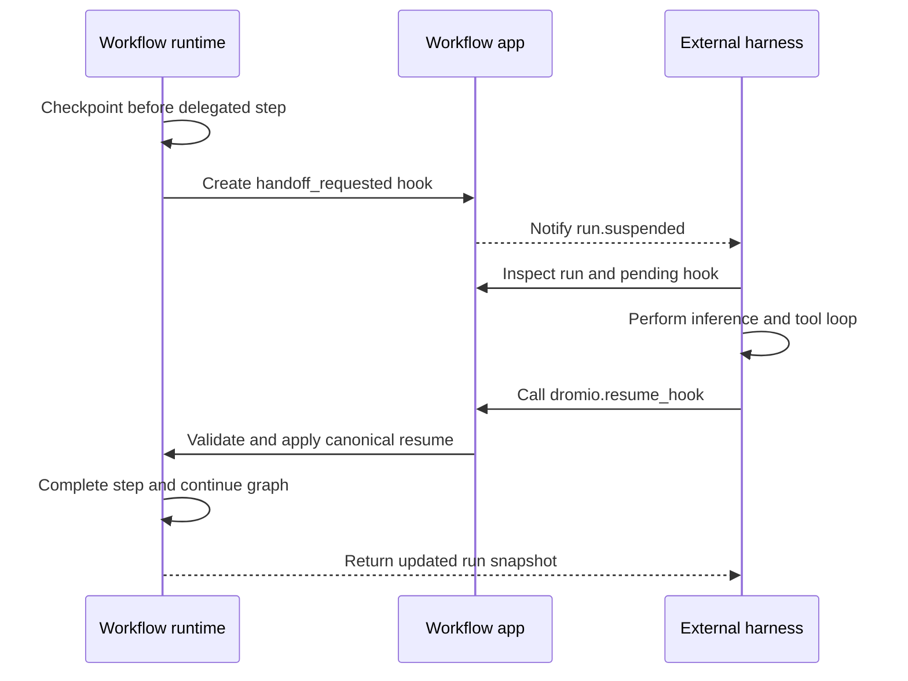
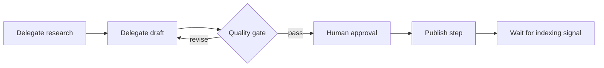

# Dromio Workflow

Build typed, durable workflows with one public package: `@dromio/workflow`.

## Install

```bash
bun add @dromio/workflow
```

Workflow execution currently targets Bun 1.3.14 or newer. Node remains useful
for TypeScript tooling, but it is not a supported Workflow runtime while the
control-plane package uses Bun's SQLite driver.

## First step

```ts
import { step } from "@dromio/workflow";
import { z } from "zod";

export const greet = step({
  id: "greet",
  input: { name: z.string() },
  output: { message: z.string() },
  run: ({ input }) => ({ message: `Hello, ${input.name}!` }),
});
```

Common authoring primitives are exported from the package root. Advanced client,
React, rendering, and control-plane APIs use deliberate subpath exports such as
`@dromio/workflow/client` and `@dromio/workflow/react`.

The package gate compiles and executes a complete workflow built from this step
inside a clean consumer before a release can be promoted.

## Configuration

Basic steps and workflows do not require global configuration. Features that
reach models, storage, control planes, or user interfaces receive their adapters
at the application boundary, keeping workflow logic portable.

The terminal UI and MCP server are optional integrations, so a headless
installation does not inherit their build-time or server-adapter dependency
trees. Install `@opentui/core` plus `@opentui/solid` when using the TUI. Install
`@modelcontextprotocol/sdk` and import
`@dromio/workflow/workflow-control-plane/mcp` when hosting the MCP adapter.

## Durable run writes

Control-plane stores persist each run with a monotonic revision. Callers that
replace a run snapshot must provide the revision they observed; a concurrent
winner makes a stale write fail with an explicit revision conflict. Retry that
operation from a fresh read instead of overwriting newer events. The bundled
SQLite store enforces the same compare-and-swap contract across restarts.

## External harness delegation

Use `step.delegate()` when a bounded workflow node should be completed by an
external harness such as Codex, Claude, or OpenCode. The workflow app owns the
durable graph, checkpoint, suspension, output validation, resumption, and
routing. The harness owns inference, context management, tool use, and its own
approval policy. Capability declarations describe requirements; they do not
grant permissions.

```ts
import { step } from "@dromio/workflow";
import { z } from "zod";

export const research = step.delegate({
  id: "content.research",
  input: { topic: z.string() },
  instructions: ({ input }) => `Research competitors for ${input.topic}.`,
  context: ({ input }) => ({ topic: input.topic, locale: "en-GB" }),
  capabilities: ["browser", "search"],
  output: { report: z.string() },
  title: "Competitor research",
});
```

Reaching the step creates a durable `handoff_requested` pending hook. Its
payload contains the resolved instructions, explicitly selected context,
capability requirements, artifact references when supplied, run/workflow/step
identity, and the machine-readable output schema. The run snapshot is the
authoritative handoff after reconnect or restart.

The workflow control-plane MCP provider exposes `dromio.resume_hook`. It
accepts the hook `token`, a JSON-compatible `value`, and optional observational
`source` fields (`adapter` and `participant`), then returns the updated run
snapshot. Invalid output leaves the same hook waiting for a corrected result.
Tool authorization continues to be enforced by the external harness and the
control-plane deployment.



A repeated SEO workflow can therefore delegate research and drafting while
keeping deterministic and human-controlled work in its existing primitives:



In this lifecycle, an **event** is an observation emitted by the workflow; a
**hook** is an addressed response required by a suspended step; a **signal** is
an independently arriving correlated occurrence; a **checkpoint** is durable
state used for recovery or reruns; **delegation** is a bounded handoff to an
external harness; and the **harness** is the agent environment that owns
inference, context management, tools, and approvals. A suspended run is
durably waiting—it is not an in-memory agent process.

## Examples and guides

The Workflow SDK guide progresses from the first typed workflow through
composition, human input, models and evaluation, events and traces, application
surfaces, and current API status. Examples use the canonical package root first
and introduce subpath APIs only when they are needed. The guide will be linked
here when the production documentation deployment is public.

## Develop

```bash
make setup
make check
make release-rehearse
```

`make check` builds the complete workflow-owned package closure, checks the
public API, packs all nine packages in the release closure, installs them into a
clean consumer, imports every supported public subpath, and compiles and runs a
representative workflow. `make release-rehearse` additionally validates the
dependency order and publication metadata without contacting npm.

The closure packages remain local build and clean-consumer inputs. The public
release workflow publishes only `@dromio/workflow`; shared Dromio packages are
versioned and published by their owning repository, so a Workflow release can
never replace those packages with an older standalone copy.

## Repository boundary

This repository owns the Workflow authoring package and the tightly coupled
workflow-domain packages needed to build and release it. Applications,
providers, hosted services, and Dromio workspace orchestration remain in their
respective repositories.

Licensed under Apache-2.0.
